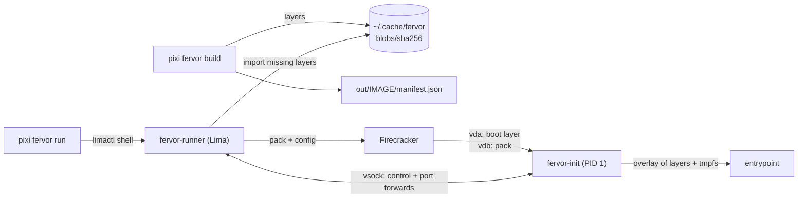

# fervor

`pixi fervor` builds Firecracker microVM images from conda packages and boots them.

```sh
pixi fervor build -s python=3.12 -s flask --copy ./app:/app --workdir /app -o out/flask -- python app.py
pixi fervor run out/flask -p 8080:5000      # http://localhost:8080 (guest port 5000), Ctrl-C stops the guest
```

An image is a `manifest.json` that points at content-addressed SquashFS layers:
one layer per conda package, small packages (< 1 MiB) merged into one layer,
one layer per `--copy`, and a boot layer (fervor's init + glibc). Layers are
built once and shared across images; running an image on another machine only
transfers the layers it does not have yet.

## Requirements

- Build host: macOS (Apple Silicon) or Linux (aarch64, x86_64), with
  [pixi](https://pixi.sh). Images can be built for either guest
  architecture (`--platform linux-aarch64|linux-64`).
- Run host: Linux with `/dev/kvm` and the image's architecture (KVM does not
  emulate other CPUs). On macOS, fervor boots aarch64 images inside a
  [Lima](https://lima-vm.io) VM with nested virtualization (M3 or newer,
  macOS 15+):

  ```sh
  pixi global install -c https://prefix.dev/github-releases lima
  pixi run lima-up     # creates the `fervor` instance from lima/fervor.yaml
  pixi run lima-kvm    # /dev/kvm must be listed
  ```

Firecracker (v1.17.0) and its CI guest kernel (6.18.51) for the image's
architecture are downloaded and sha256-verified on first run.

## Development

```sh
pixi run build                # builds pixi-fervor (build.rs cross-compiles fervor-init + fervor-runner)
pixi run test
pixi run example-flask-run    # builds and boots examples/flask
pixi run fervor -- --help     # runs the freshly built binary
pixi build                    # packages pixi-fervor as a .conda (pixi-build-rust)
```

`pixi-fervor` embeds the Linux `fervor-init` for both guest architectures (and,
on macOS, `fervor-runner`), so the release binary is self-contained. Its
`build.rs` cross-compiles them with `cargo zigbuild`, which the pixi
environment provides.

## Commands

| Command | Notes |
|---|---|
| `build -s SPEC… [-c CHANNEL…] [--copy SRC:DEST…] [-e NAME=VALUE…] [--workdir DIR] -o DIR -- CMD…` | `--platform` (default: host arch), `--small-layer-threshold` (default `1MiB`), `--allow-conflicts`, `--scratch-size-mib` |
| `run DIR [-p [IP:]HOST:GUEST…]` | `--vcpus`, `--memory` (MiB), `--run-host local\|lima[:INSTANCE]` (default: `lima:fervor` on macOS, `local` on Linux), `--shutdown-grace-secs` |

`-p HOST:GUEST` publishes the guest's `127.0.0.1:GUEST` on the host. The app's
own log shows the guest port (Flask prints `Running on …:5000`); browse the
host port. On macOS the AirPlay Receiver already serves 5000 and 7000, so
`run` refuses to publish a port another program answers on.

The exit status of `run` is the entrypoint's (signals as `128 + n`, 125 when
the guest could not report). Caches live in `$FERVOR_CACHE_DIR`, else
`~/.cache/fervor` (`--cache-dir` overrides).

## How a run works



- **vda** is the boot layer (read-only root). **vdb** is the *pack*: a header
  (layer table + guest config) followed by the layers at 4 KiB-aligned offsets.
- `fervor-init` attaches a loop device per layer, stacks them with overlayfs
  under a tmpfs scratch layer, pivots into the result and runs the entrypoint.
- The control channel (vsock port 1024) reports readiness and the exit status
  and carries shutdown requests; forwarded ports go over vsock port 1025.

## Code layout

One shared domain model holds pure image-building rules and validated types.
Concrete adapters handle I/O; no traits between layers while each piece has one
implementation. Runtime release pins, kernel boot arguments and guest protocol
conversions live in `fervor-vmm`; the domain does not depend on the guest ABI.

| Crate | Role |
|---|---|
| `fervor-domain` | Shared model: environments, layer planning and identities, validated images + manifests, run requests/results. |
| `fervor-guest-abi` | Host↔guest contract: pack format, guest config and control/forward protocol, plus shared startup backoff. |
| `fervor-app` | `ImageBuilder`: resolve → layers → manifest. |
| `fervor-conda` | `RattlerResolver`, `RattlerPackageContents` (archives read in memory, never unpacked on the host). |
| `fervor-layerfs` | `SquashfsLayerBuilder` (deterministic), `HostTreeReader`. |
| `fervor-store` | `LayerStore` (blobs + key index), `ImageDir` (`manifest.json`). |
| `fervor-vmm` | Runtime release pins, artifact cache, packing, Firecracker boot config and guest protocol adapters; `LocalRunHost`. |
| `fervor-runner` | Linux binary the Lima run host drives. |
| `fervor-init` | Guest PID 1. |
| `pixi-fervor` | CLI; `RunHost` (local or `LimaRunHost`). |

## Limitations

- No networking besides `-p` forwards; the guest has no `/bin/sh` (scripts
  with `#!/bin/sh`, like conda-forge's `bin/flask`, do not run).
- Python bytecode is compiled at first import on every boot.
- `[tool.fervor]` / `pixi.lock` input is not supported yet; everything comes
  from the command line.
